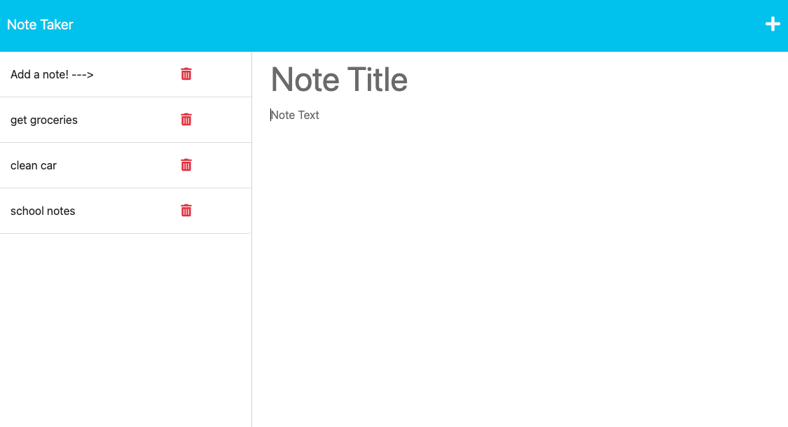

# Note Taker

## Table of Contents:

- [Description](#description)

- [Usage](#usage)

## Description

Application is used to write,save. and delete notes. This application uses an Express.js back end and also saves and retrieves note data from a JSON file.

## Usage:

User is able to write, save, and delete notes by using data persistence via a JSON file.

## Questions:

If you have any questions, you may contact me at either

- Github: https://github.com/dmilleza
  or
- Email: darrenmilleza@gmail.com
